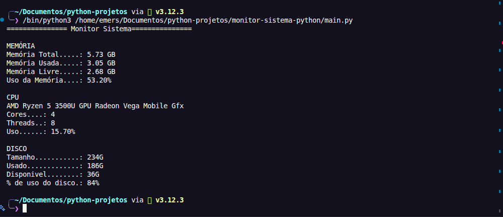

# Monitor de Sistemas em Python

Projeto desenvolvido durante meus estudos de Python com o objetivo de monitorar informações do sistema Linux.

## Sobre o projeto

Atualmente, o projeto realiza o monitoramento de

- Memória RAM
- Informações da CPU
- Porcentagem de uso da CPU
- Armazenamento/Disco


## Funcionalidades

- Ler informações de memória do sistema
- Cálculo de uso da memória
- Leitura de informaçoes da CPU
- Cálculo de uso da CPU
- Leitura de informações do armazenamento
- Exibição das informações no terminal

## Tecnologias utilizadas

- Python3
- Linux
- `/proc/meminfo`
- `/proc/cpuinfo`
- `/proc/stat`
- `df`

## Como executar

Clonar o repositório:

git clone git@github.com:aemsEmerson/monitor-sistema-python.git

Entre na pasta:

cd monitor-sistema-python

executar o programa:

python3 main.py

## Exemplo de saída



## Evolução do projeto

- [x] Versão - 1.0.0 Monitoramento de memória RAM
- [x] Versão - 1.1.0 Monitoramento de CPU
- [x] Versão - 1.2.0 Monitoramento de armazenamento e refatoração da arquitetura
## Próximas melhorias

- [ ] Monitoramento em tempo real

## Estrutura do Projeto

```text
monitor-sistema-python/
├── imagens/
│   └── monitor-sistema.png
├── main.py
├── README.md
└── .gitignore